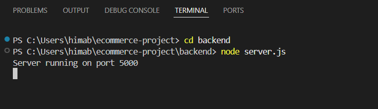
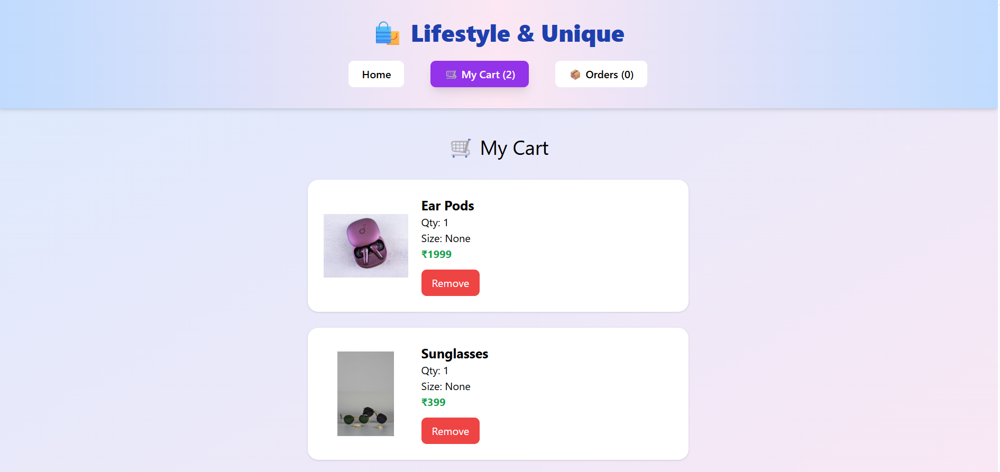
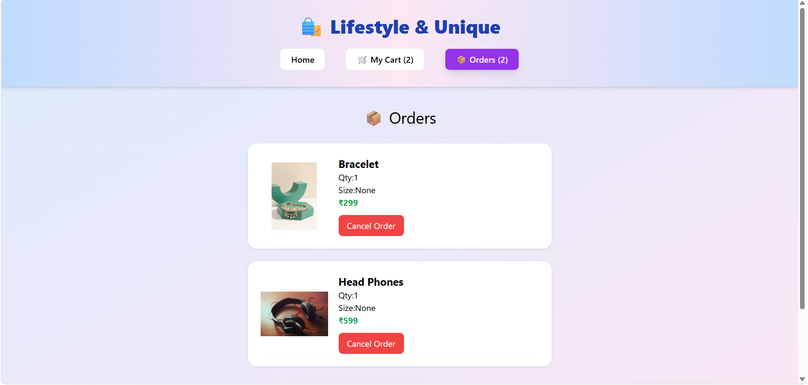
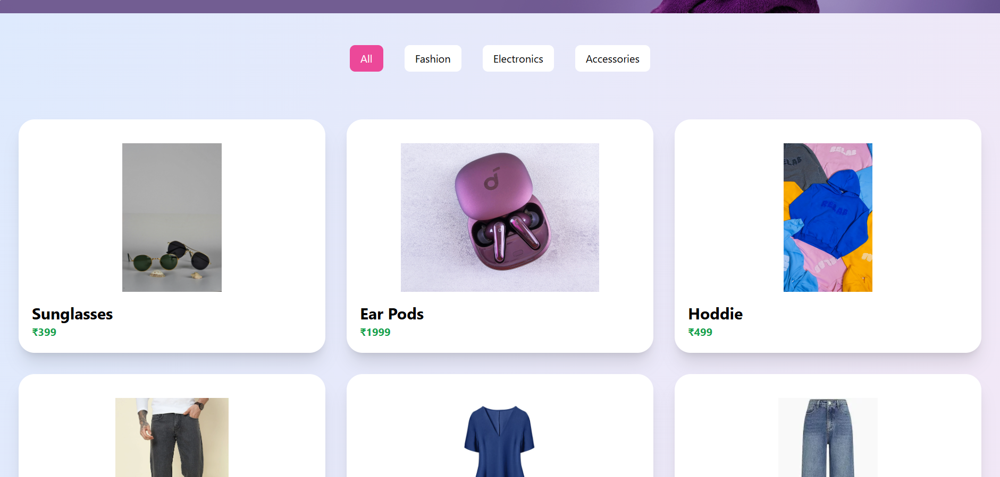

# 🛒 E-Commerce Web Application

A modern and responsive E-Commerce web application built using **MERN Stack / Frontend Technologies** (update based on your project). This project allows users to browse products, add items to cart, and simulate a shopping experience.


---

## 📌 Features

- 🛍️ Product listing with images and details  
- 🔍 Search functionality for products  
- 🛒 Add to Cart / Remove from Cart  
- 💰 Cart summary with total price calculation  
- 📱 Fully responsive design (mobile + desktop)   
- ⚡ Smooth and interactive UI  

---

## 🧑‍💻 Tech Stack

**Frontend:**
- HTML5
- CSS3
- JavaScript / React.js 

**Backend:**
- Node.js
- Express.js

**Database:**
- MongoDB Compass

---
## 🚀 **Getting Started**
```bash


# Clone the repository
git clone https://github.com/Himabindhu-123/ecommerce-project.git

# Navigate to project folder
cd ecommerce-project

# Install dependencies
npm install

# Start the development server
npm start
```

---

## 🖼️ Screenshots

### Backend


### Home Page


### Cart Page


### Orders Page


### Categories Page


---

## 🔮 Future Enhancements  
- User authentication (Login / Signup)  
- Secure payment gateway integration  
- Order history tracking  
- Admin dashboard for product management  
- Improved UI/UX with animations  

---

## 🤝 Contribution  
Feel free to fork this repository and submit pull requests for improvements or new features.  

---

## 📄 License  
This project is developed for learning and academic purposes.  

---

## 👩‍💻 Developer  
Created by **Ravuri Himabindhu**
